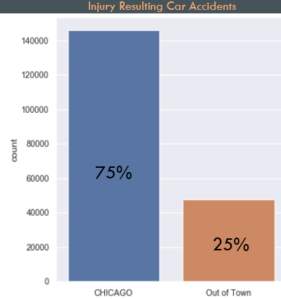

# Traffic-Accident-Severity
by Deric Williamson

## Introduction/Business Case
For the Chicago Department of Transportation, as a data scientist, my job is to go over the city’s traffic accident reports and create a model that will predict the worst incidences. In doing so, I will find some underlying causes and possible advice for the city.   

For the Chicago Department of Transportation, this data will help reduce the number of traffic accidents that result in injury.

Drivers will always be distracted while driving, so what can we do to help reduce injury in accidents?

## The Data
The data was taken from cityofchicago.org/transportation and was created from the city of Chicago’s electronic crash reporting system from 2015 to present. 

There were three different datasets that I derived information from. The datasets were about the people, the vehicles, and the specific crashes involved which I combined into one dataset for this project.  

The data was used to predict whether an accident resulted in an injury or not, as shown by the graph. This shows that the data was imbalanced at 24 percent resulting in some type of injury.

  

## Exploratory Data Analysis

25 percent of severe traffic accidents resulted from out-of-town drivers  
  

Chicago has a high number of tourists and many suburbs that surround the city. This could contribute to reasons for a high percentage of severe traffic accidents by out-of-town drivers. 

  
The graph shows that 41% of intersection related accidents resulted in some type of injury.

  
Top 10 primary causes of traffic accidents 

## Preprocessing
Most of the features are categorical, so I will .get_dummies the categorical features, then I will apply the anova statistical test to weed out high p-values 

  

## Modeling Process
In this phase, I am going to fit the data into four separate models (Logistic Regression, Decision Tree, Random Forest, and K Nearest Neighbors) to see which model can best classify the data for a stronger predictive power.

Some scores that I will be paying attention to help determine the model's performance is:

- Accuracy: (tp + tn) / (tp+fp+fn+tn)
- Recall: (tp) / (tp+fn)
- AUC: Area Under Curve

#### Logistic Regression

  

#### Decision Tree
  
  

#### Random Forest
  
  

