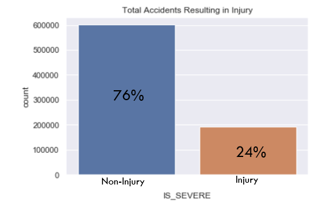
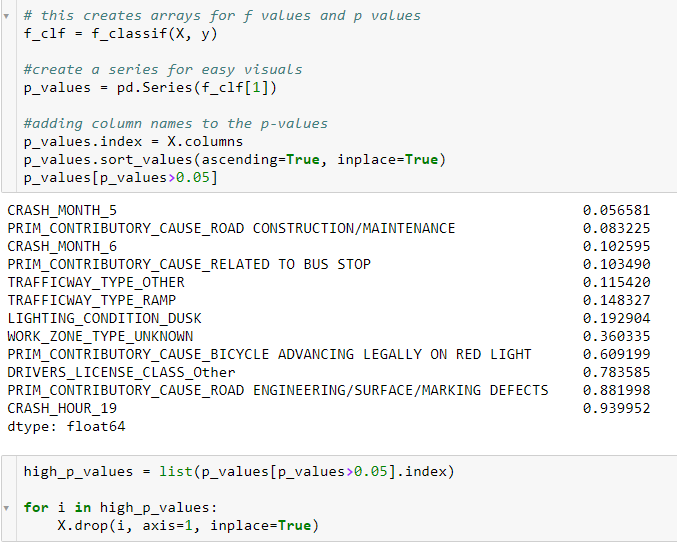
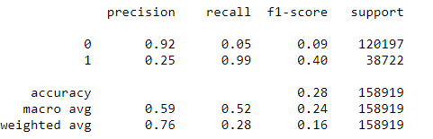
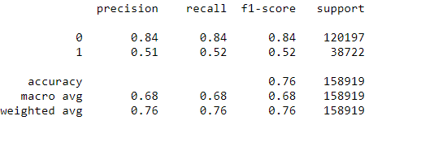
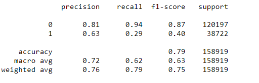

# Traffic-Accident-Severity
by Deric Williamson

## Introduction/Business Case
For the Chicago Department of Transportation, as a data scientist, my job is to go over the city’s traffic accident reports and create a model that will predict the worst incidences. In doing so, I will find some underlying causes and possible advice for the city.   

For the Chicago Department of Transportation, this data will help reduce the number of traffic accidents that result in injury.

Drivers will always be distracted while driving, so what can we do to help reduce injury in accidents?

## The Data
The data was taken from cityofchicago.org/transportation and was created from the city of Chicago’s electronic crash reporting system from 2015 to present. 

There were three different datasets that I derived information from. The datasets were about the people, the vehicles, and the specific crashes involved which I combined into one dataset for this project.  

The data was used to predict whether an accident resulted in an injury or not, as shown by the graph. This shows that the data was imbalanced at 24 percent resulting in some type of injury.

  

## Exploratory Data Analysis

25 percent of severe traffic accidents resulted from out-of-town drivers (graph on left) 

> Chicago has a high number of tourists and many suburbs that surround the city. This could contribute to reasons for a high percentage of severe traffic accidents by out-of
-town drivers. 

   
  

**The graph on the right shows that 41% of intersection related accidents resulted in some type of injury.**

  
Top 10 primary causes of traffic accidents 

## Preprocessing
Most of the features are categorical, so I will .get_dummies the categorical features, then I will apply the anova statistical test to weed out high p-values 

  

## Modeling Process
In this phase, I am going to fit the data into four separate models (Logistic Regression, Decision Tree, Random Forest, and K Nearest Neighbors) to see which model can best classify the data for a stronger predictive power.

Some scores that I will be paying attention to help determine the model's performance is:

- Accuracy: (tp + tn) / (tp+fp+fn+tn)
- Recall: (tp) / (tp+fn)
- AUC: Area Under Curve

### Logistic Regression
Logistic Regression is a model that utilize an s-shape curve that helps categorize the data into a binary classification.  

### Decision Tree
Decision Tree is another predictive modeling approach that works similar to a flowchart-like structure. The tree is mainly made up of decision nodes(conditionals) and leaves(decision on final outcome).  

  

### Random Forest
Random Forest builds multiple decision trees can merge them together to get a better performing prediction.  

  

## Final Model
Our Decision Tree had the highest accuracy with decent recall and auc scores out of the other baseline models.  
The goal now is to fine tune the decision tree for better accuracy and result scores.  

### Grid Search
sklearn.model_selection.GridSearchCV will help fine tune this model by running a series of models with all combinations of model parameters. This will help with performance and over-fitting problems.

Some Decision Tree parameters include:

- *criterion*: The function to measure the quality of a split.
- *max_depth*: The maximum depth of the tree.
- *min_samples_split*: The minimum number of samples required to split an internal node
- *min_samples_leaf*: The minimum number of samples required to be at a leaf node.

**output**
> Mean Training Score: 80.07%  
> Mean Test Score: 79.27%  
> Best Parameter Combination Found During Grid Search:  
  
> {'criterion': 'gini',  
> 'max_depth': 6,  
> 'min_samples_leaf': 1,  
> 'min_samples_split': 5}  

### Final Decision Tree

Accuracy slightly went up from .76 to .79  
Recall dipped down from .52 to .29  
Auc slightly went up .68 to .70

### Feature Importances

## Recommendations
Intersections, Rear-ending, and failing to reduce speed ranked the highest on the 'feature importance' table. I believe the city of Chicago needs to spend time on researching the effects of adding roundabouts in high traffic intersections. Not only will adding roundabouts lower the chance of a traffic accident becoming severe, but it will also make the driver less dependent on traffic lights and be forced to pay more attention to their surroundings. Another thing that can be done to intersections is that the lanes can be widened to allow for a clear line of sight for drivers turning right on red.

While exploring my data about out-of-town verses in town drivers, I realized that there was a high number of wrecks involving drivers that were not from the city of Chicago. With 23.7 percent of wrecks happening from out-of-town drivers, I believe that this could be due to some of these drivers being from the many suburbs of Chicago. I think the city needs to brainstorm ideas on how this can be improved upon, whether it be making the roadways less complicated or being diligent on better road sign placement throughout the city.

The idea of being able to walk safely along the many sidewalks of Chicago as a pedestrian should never be something that becomes an issue. But my data has shown that being a pedestrian was the second most important feature related to severe car accidents in the city. There are many things the city can do to improve upon pedestrian safety and make it easier for drivers to navigate these pedestrians. First, widening driving lanes and adding more right sided shoulders for drivers will give more room for driving errors and increase the time a driver has to react and not hit a pedestrian. Secondly, adding additional sidewalks will make the city more pedestrian friendly. Another would be to increase the distance between the road and the sidewalks, giving both pedestrians and drivers more space to walk or drive safely. Lastly, let's increase the amount of raised pedestrian crosswalks in the city. This will eliminate the possibly of a driver hitting a pedestrian while they are crossing an intersection, thus making our intersections safer as well.

## Future Work
Most of my future work will be focused on improving my final model by:

- Raising ROC curve thresholds as previously mentioned to raise recall score (and lowering the False Negatives)
- Running a scatter plot on misclassified data to find a common theme as to why it was misclassified
- Looking at feature importance on the chosen model and drop the lowest to speed up future works

